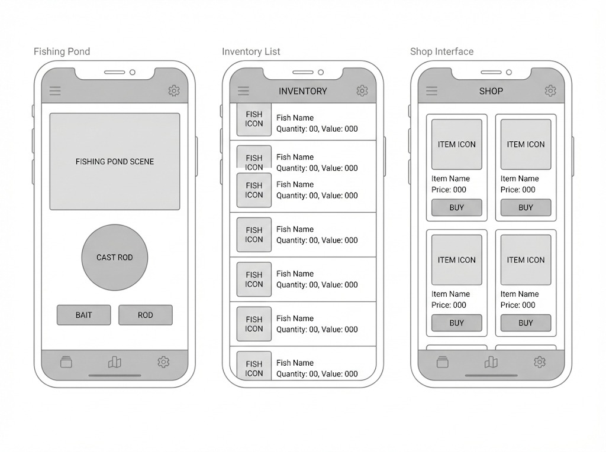
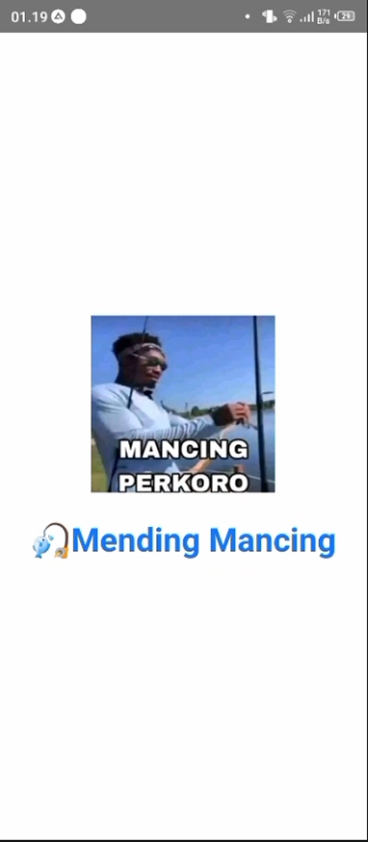
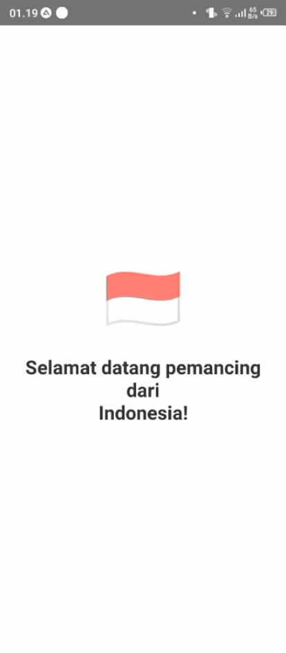
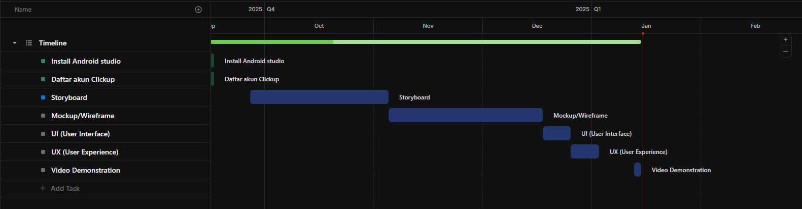

# 🎣 Mending Mancing (Mobile Version)

> **Project Pemrograman Mobile 1**
> Aplikasi simulasi memancing berbasis Android (WebView) dengan fitur deteksi lokasi pengguna.

---

## 👨‍🎓 Identitas Mahasiswa

| Informasi | Detail |
| :--- | :--- |
| **Nama** | Fadhil Al Haidar |
| **NIM** | 312410249 |
| **Kelas** | TI.24.A.2 |
| **Dosen** | Donny Maulana, S.Kom., M.M., M.Kom. |
| **Mata Kuliah** | Pemrograman Mobile 1 |

---

## ✅ 1. Splash Screen (Location Detection)

Fitur Splash Screen yang menyapa pengguna berdasarkan lokasi GPS mereka secara real-time.
* **Teknologi:** Android Native (Java), `LocationManager`, `Geocoder`.
* **Logic:** Mendeteksi koordinat GPS -> Convert ke Kode Negara (Reverse Geocoding) -> Menampilkan Emoji Bendera & Teks Sambutan.

| Scene 1 (Logo Intro) | Scene 2 (Lokasi & Bendera) |
| :---: | :---: |
|  |  |
| *Animasi Logo masuk* | *Deteksi: "Selamat datang dari Indonesia"* |

---

## 🎨 2. Storyboard Project

Alur cerita pengguna (*User Journey*) dari mulai membuka aplikasi hingga mendapatkan ikan legendaris.

---

## 📱 3. Mockup Project

Desain High-Fidelity yang dibuat menggunakan Figma sebelum proses development.

---

## 🖼️ 4. User Interface (UI) Implementation

Implementasi antarmuka aplikasi yang sudah berjalan (Live).

---

## 🎥 5. User Experience (UX) - Video Prototype

Demonstrasi penggunaan aplikasi secara menyeluruh dapat dilihat pada video berikut:

> **[Klik di sini untuk menonton Video Demo di YouTube](https://www.youtube.com/watch?v=Of7JQnS0LSQ)**

---

## 📅 6. Project Management (Timeline)

Penjadwalan pengerjaan proyek menggunakan **ClickUp**.

**Link ClickUp:** [(https://sharing.clickup.com/90181808771/g/h/2kzm2cm3-438/65d90fddb201581)]

---

## 🛠️ Teknologi yang Digunakan

* **Android:** Java, WebView, XML Layout.
* **Web Backend:** PHP Native (MVC Pattern).
* **Database:** MySQL.
* **Tools:** Android Studio, Figma, Visual Studio Code.

---

*Disusun untuk memenuhi Tugas UAS Pemrograman Web & Mobile Pelita Bangsa.*
